# Departures Card Compact


A card to display departure times provided by [Departures](https://github.com/alex-jung/ha-departures) custom integration. This is a fork of the original [Departures Card] (https://github.com/alex-jung/ha-departures-card) v2.2.1 to preserve this compact layout and optimize it further.

<p align="center">
  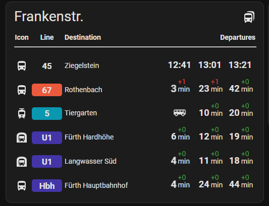
</p>

## Installation

#### Manual

1. Download from last release `dist/ha-departures-card.js` file.
2. Activate Home Assistant `advanced mode` (Profile -> Advanced mode)
3. Open `settings -> Dashboards` and click on tree dots in right upper corner
4. Click on `Ressourcen` and then on `Add Ressource` button
5. Add `local/ha-departures-card.js` as JS module
6. Refresh the page

#### HACS (recommended)

1. Add this repository as a custom repository (HACS -> Custom repositories, type "Dashboard")
2. Search for `Departures Card Compact` and install it.
3. Add new card to dashboard

## Card Properties

| yaml attribute                              | Type            | Required | Default value            |
| ------------------------------------------- | --------------- | -------- | ------------------------ |
| type                                        | string          | yes      | `custom:departures-card-compact` |
| [title](#title)                             | string          | no       | Departures               |
| [debug](#debug)                             | boolean         | no       | false                    |
| [icon](#icon)                               | string          | no       | mdi:bus                  |
| [showCardHeader](#showCardHeader)           | boolean         | no       | true                     |
| [showAnimation](#showanimation)             | boolean         | no       | true                     |
| [showTransportIcon](#showtransporticon)     | boolean         | no       | false                    |
| [hideEmptyDepartures](#hideemptydepartures) | boolean         | no       | false                    |
| [departuresToShow](#departurestoshow)       | number (max. 5) | no       | 1                        |
| entities                                    | entity[]        | yes      | -                        |

### "title"

**Default**: Departures

Sets the card's title, e.g., "Plärrer.".
If no title provided, the default value is used (based on user language setting)

```yaml
type: custom:departures-card-compact
title: Frankenstr.
```

| empty                                   | title: "Frankenstr."            |
| --------------------------------------- | ------------------------------- |
| 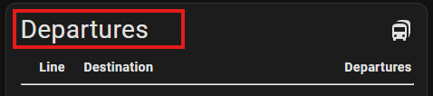 | 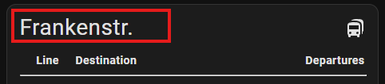 |

### "debug"

**Default**: false

Provides an option to debug data returned by the API.

```yaml
type: custom:departures-card-compact
debug: true
```

### "icon"

**Default**: mdi:bus

Defines the icon displayed on the card.

```yaml
type: custom:departures-card-compact
icon: mdi:bus-multiple
```

| empty                                  | icon: mdi:bus-multiple                 |
| -------------------------------------- | -------------------------------------- |
| 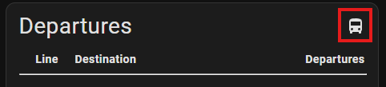 | 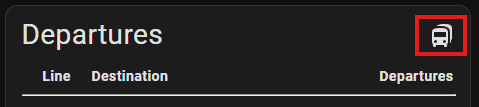 |

### "showCardHeader"

**Default**: true

Defines the card header to show or not.

```yaml
type: custom:departures-card-compact
showCardHeader: true
```

| showCardHeader: true                     | showCardHeader: false                      |
| ---------------------------------------- | ------------------------------------------ |
| 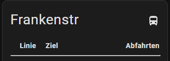 | 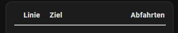 |

### "departuresToShow"

**Default**: 1

This options specifies the number of departure entries to display on the card. By default, it is set to 1, meaning only the next departure will be shown.
Users can increase this value up to 5 to show multiple upcoming departures, depending on their preferences or the available space on the dashboard.

```yaml
type: custom:departures-card-compact
departuresToShow: 3
```

| empty                                          | departuresToShow: 3                            |
| ---------------------------------------------- | ---------------------------------------------- |
| 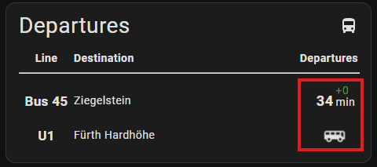 | 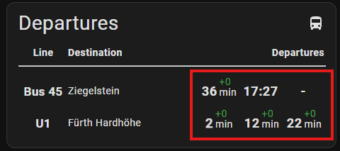 |

### "showAnimation"

**Default**: true

The showAnimation option enables a visual animation to highlight upcoming departures. When the remaining time until the arrival of a vehicle falls below 5 minutes, the corresponding display element will begin to pulse. This serves as a visual alert to draw the user's attention to the imminent departure.

```yaml
type: custom:departures-card-compact
showAnimation: true
```

| showAnimation: true                |
| ---------------------------------- |
| 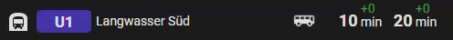 |

### "showTransportIcon"

**Default**: false

The showTransportIcon option controls whether an icon representing the type of vehicle (e.g., bus, subway, tram) is displayed.

```yaml
type: custom:departures-card-compact
showTransportIcon: true
```

| showTransportIcon: false                            | showTransportIcon: true                            |
| --------------------------------------------------- | -------------------------------------------------- |
| 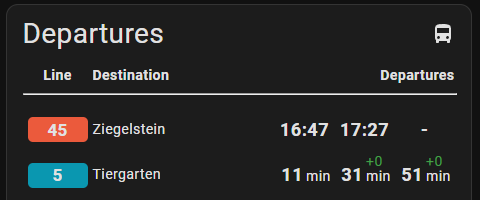 | 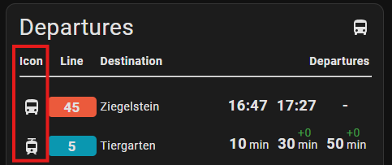 |

### "hideEmptyDepartures"

**Default**: false

The hideEmptyDepartures option controls whether lines without any departure times are displayed.

```yaml
type: custom:departures-card-compact
hideEmptyDepartures: true
```

| hideEmptyDepartures: false                   | hideEmptyDepartures: true                    |
| -------------------------------------------- | -------------------------------------------- |
| 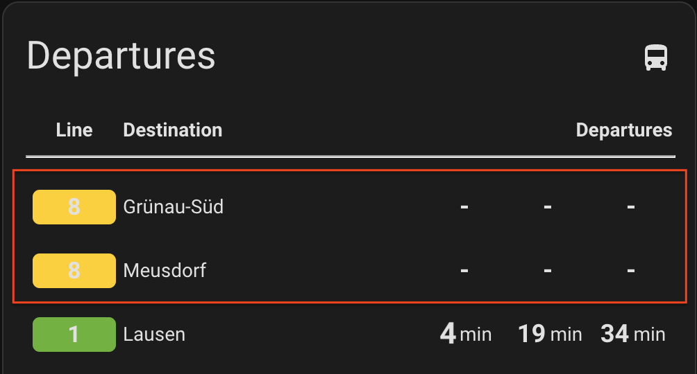 | 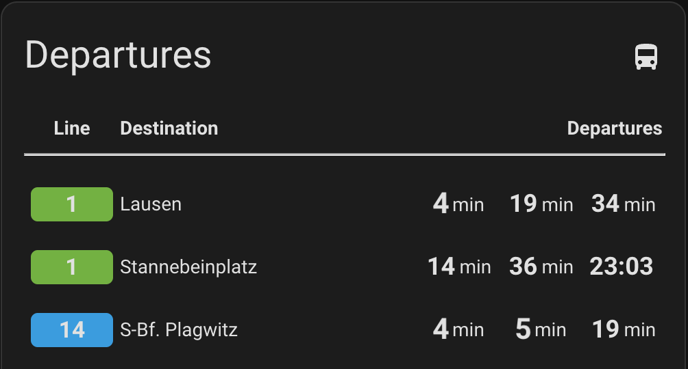 |

## Entity Properties

| yaml attribute                      | Type   | Required | Default value |
| ----------------------------------- | ------ | -------- | ------------- |
| [linecolor](#linecolor)             | string | no       | empty         |
| [linename](#linename)               | string | no       | empty         |
| [timestyle](#timestyle)             | string | no       | dynamic       |
| [destinationname](#destinationname) | string | no       | empty         |
| [nowIcon](#nowicon)                 | string | no       | empty         |

### "lineColor"

**Default**: empty (no background color)

The "lineColor" option specifies the background color used to represent a vehicle line on the card. This allows users to visually distinguish different lines by assigning them unique colors. The color can be defined using standard formats like a hex code (e.g., "#FF5733") or a predefined color name.

```yaml
type: custom:departures-card-compact
entities:
  - entity: sensor.nurnberg_frankenstr_bus_45_ziegelstein_u_mogeldorf
    lineColor: "#EB5A3C"
```

| empty                                  | lineColor: "#EB5A3C"                        |
| -------------------------------------- | ------------------------------------------- |
| 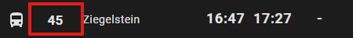 | 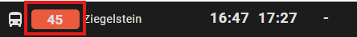 |

### "lineName"

**Default**: Name provided by the server.

The "lineName" option specifies the name or identifier of the vehicle line (e.g., bus number, train line, or tram route) displayed on the card.

```yaml
type: custom:departures-card-compact
entities:
  - entity: sensor.nurnberg_frankenstr_bus_45_ziegelstein_u_mogeldorf
    lineName: 45
```

| empty                                 | lineName: 45                               |
| ------------------------------------- | ------------------------------------------ |
| 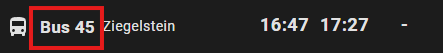 | 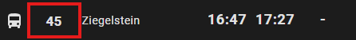 |

### "timeStyle"

**Default**: dynamic

- "dynamic"
  If the time to the next departure is less than 60 minutes, it is displayed as a relative time (e.g., "in 15 min").
  If the time is 60 minutes or more, it is displayed as an absolute timestamp (e.g., "14:30").

- "timestamp"
  The departure time is always displayed as an absolute timestamp (e.g., "14:30"), regardless of how far in the future it is.

```yaml
type: custom:departures-card-compact
entities:
  - entity: sensor.nurnberg_frankenstr_bus_45_ziegelstein_u_mogeldorf
    timeStyle: timestamp
```

| empty                                        | timeStyle: timestamp                     |
| -------------------------------------------- | ---------------------------------------- |
| 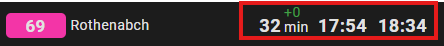 | 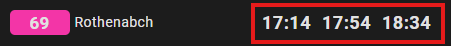 |

### "destinationName"

**Default**: Destination name provided by the server.

Option to overwrite default destination name provided by API.

```yaml
type: custom:departures-card-compact
entities:
  - entity: sensor.nurnberg_frankenstr_bus_45_ziegelstein_u_mogeldorf
    destinationName: Ziegelstein
```

| empty                                         | destinationName: Ziegelstein                  |
| --------------------------------------------- | --------------------------------------------- |
| 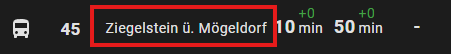 | 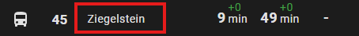 |

### "nowIcon"

**Default**: empty

With `nowIcon` the user can overwrite default icon shown for now arriving transports.
If no custom icon is defined, the transport type icon provided by `ha-departures` is used.

```yaml
type: custom:departures-card-compact
entities:
  - entity: sensor.frankenstr_u_bahn_u1_langwasser_sud
    nowIcon: mdi:rv-truck
```

| empty                                     | nowIcon: mdi:rv-truck                    |
| ----------------------------------------- | ---------------------------------------- |
| 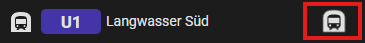 | 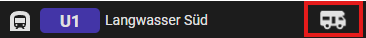 |
